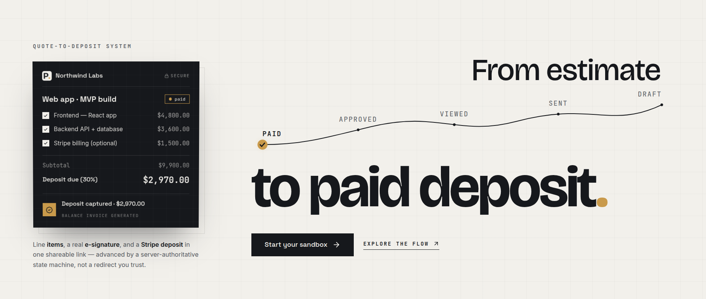

<div align="center">

  <h1>
    
  </h1>

  <p><strong>Turn an estimate into a signed agreement and a paid deposit — in one link.</strong></p>

  
  
  
  
  
  
  
  

  <br />

  

</div>

---

> PactLink is a quote-to-deposit system for service businesses. It collapses a three-tool workflow — document editor, e-signature, separate payment invoice — into a single shareable link where a client reviews a quote, toggles optional items, e-signs, and pays a deposit. The deposit confirmation and balance-invoice generation are driven by **Stripe webhooks**, not browser redirects, so the money state is always server-authoritative.

##  About

Contractors, agencies, photographers, event/AV companies, and consultants build quotes in a doc editor, email a PDF, then chase the client separately for approval and a deposit. Deals stall in that gap.

PactLink ties the whole flow together. A business owner builds a branded quote with line items, taxes, and optional/tiered items; PactLink hosts it at an unguessable link. The client (no account needed) opens it, toggles options that recalculate totals server-side, signs with a captured timestamp + IP, and pays a deposit via Stripe. A webhook-driven state machine advances the quote through `draft → sent → viewed → approved → deposit_paid`, auto-generates the balance invoice, and emails both parties. The owner watches a conversion funnel and an idempotent webhook event log as proof of correctness.

The product is **login + sandbox only** — there is no public self-serve signup; access is via seeded accounts or a temporary in-browser sandbox.

##  Features

- **Quote builder** — line items, per-line and global taxes, and `optional`/`tiered` items the client can toggle; totals always recomputed server-side.
- **Hosted approval link** — unauthenticated, tokenized client page; no account required to view, sign, or pay.
- **E-signature** — typed or drawn signature with server-recorded timestamp and IP; pluggable DocuSeal adapter, with a fully offline internal path.
- **Webhook-first Stripe deposit** — a deposit (fixed amount or %) charged on approval; the transition to `deposit_paid` happens only on a verified `payment_intent.succeeded` webhook, never a client callback.
- **Automatic balance invoice** — generated once, idempotently, after the deposit settles.
- **Status pipeline & analytics** — `draft → sent → viewed → approved → deposit_paid`, a viewed/approved/deposit-paid funnel, and median time-to-approval.
- **Idempotent webhook event log** — every inbound event persisted and de-duplicated by a unique event id; duplicates are no-ops.
- **Branded PDF** — Puppeteer-rendered quote PDF reflecting the live selection, with an HTML fallback when Chromium is unavailable.
- **Sandbox mode** — explore the full dashboard with seeded data in an isolated in-memory session that resets on tab close.

##  Tech Stack

- **Frontend:** React 18, Vite, TypeScript, Tailwind CSS, Zustand, React Hook Form + Zod, React Router v6, Recharts, Framer Motion, Stripe.js + Elements, signature_pad.
- **Backend:** Node.js 22, Express, TypeScript, Mongoose, Zod, JWT (bcrypt), Stripe SDK, Nodemailer, Puppeteer, `express-rate-limit`, Helmet.
- **Database:** MongoDB (Mongoose ODM) — quotes stored as documents with embedded line items.
- **Infra / Tooling:** npm workspaces monorepo, Vitest + mongodb-memory-server, Docker (api), optional S3/R2 object storage.

##  Architecture

Two surfaces share one React build: the authenticated **owner dashboard** and the unauthenticated **client approval page** reached by a per-quote link token. The Express API is the authority on price and money — client-submitted totals are never trusted, and money transitions are gated on verified Stripe webhooks.

```mermaid
flowchart TD
    O[Owner dashboard] -->|build + send quote| API[(Express API)]
    API -->|tokenized link| C[Client approval page]
    C -->|toggle items / sign| API
    C -->|card via Stripe Elements| S[Stripe]
    S -. payment_intent.succeeded .-> WH[/webhooks/stripe/]
    WH -->|insert eventId UNIQUE = idempotent| LOG[(webhookEvents)]
    WH --> SM{State machine}
    SM -->|signature exists?| SM
    SM -->|mark paid + deposit_paid| DB[(MongoDB)]
    SM -->|create once| INV[Balance invoice]
    SM -->|enqueue| MAIL[Email both sides]
```

The browser's Stripe result is treated as advisory ("Confirming payment…"); the authoritative `deposit_paid` transition, balance invoice, and notifications are produced by the webhook handler. Duplicate/retried deliveries hit a unique index on `webhookEvents.eventId` and become no-ops.

##  Project Structure

```
pactlink/
├── api/                      # Express + Mongoose + TypeScript backend
│   └── src/
│       ├── app.ts            # app factory: webhook raw-body, helmet, rate limits, router mounts
│       ├── config/           # env, db, logger, stripe, mailer, s3
│       ├── models/           # 9 Mongoose models + enums (quotes embed lineItems)
│       ├── middleware/       # JWT auth, link-token, zod validate, rate limit, error envelope
│       ├── routes/ controllers/  # auth, quotes, clients, public, signatures, payments, webhooks, analytics, pdf
│       ├── services/         # stateMachine, stripe, esign, pdf, email, analytics
│       ├── webhooks/         # Stripe signature verify + idempotent dispatch
│       ├── seed/             # demo owner + clients + quotes across the funnel
│       └── __tests__/        # vitest (idempotency, state machine, deposit gate, funnel…)
├── web/                      # React + Vite + TypeScript frontend
│   └── src/
│       ├── pages/public/     # marketing + staff/sandbox login + ClientApproval (the money surface)
│       ├── pages/dashboard/  # overview, quotes, builder, pipeline, analytics, webhooks, clients, settings
│       ├── components/       # ui, layout, sections, approval (line items, signature pad, deposit)
│       ├── services/         # api.ts + mockDb.ts (USE_API toggle: seed vs real backend)
│       ├── store/ context/   # Zustand quote-builder, Auth + Toast context
│       └── data/seedData.ts  # realistic seed covering every collection
├── docs/                     # PRD, TRD, UCD, DBD, FED
└── package.json              # npm workspaces root
```

##  Getting Started

### Prerequisites

- Node.js >= 22
- MongoDB (local or Atlas) — only required to run the API; the web app runs fully offline in mock mode.

### Installation

```bash
git clone https://github.com/yousuf-git/pactlink.git
cd pactlink
npm install            # installs both workspaces (api + web)
```

### Environment

```bash
cp api/.env.example api/.env
cp web/.env.example web/.env
```

The web app defaults to `VITE_USE_API=false` (local seed data, no backend needed). Set it to `true` and point `VITE_API_BASE` at the running API to use the real backend.

### Running

```bash
# Frontend only (offline, mock data) — quickest way to explore
npm run dev:web

# Backend only
npm run dev:api

# Both
npm run dev

# Seed the database with the demo owner + funnel/case-study data
npm run seed
```

Web dev server: `http://localhost:5173` · API: `http://localhost:4000`.

**Demo login:** `demo@pactlink.app` / `demo1234` (from `SEED_DEMO_PASSWORD`), or use the in-browser Sandbox login — no credentials needed.

##  Usage

1. Log in (or launch the sandbox) and open the dashboard.
2. Build a quote: add line items + taxes, mark some `optional`/`tiered`, set a `fixed` or `percent` deposit, then **Send** to mint a shareable link.
3. Open the client link (`/q/:token`): toggle options (totals recalculate live), sign, and pay the deposit with a Stripe test card.
4. Watch the quote advance to `deposit_paid` once the webhook confirms, with the balance invoice generated automatically.
5. Review the **Pipeline**, **Analytics** funnel, and **Webhooks** event log.

##  API Reference

Base path: `/api/v1`. Owner routes require a JWT bearer token; public routes are scoped by an unguessable quote token.

| Method | Endpoint | Description |
|---|---|---|
| `POST` | `/auth/login` | Owner / demo login → `{ token, user }` (rate-limited) |
| `GET` `POST` | `/quotes` | List / create quotes |
| `GET` `PATCH` `DELETE` | `/quotes/:id` | Read / update / delete a quote |
| `POST` | `/quotes/:id/send` | Mint link token, transition `draft → sent` |
| `GET` | `/quotes/:id/pdf` | Render the branded PDF |
| `GET` `POST` | `/clients` | List / create clients |
| `GET` | `/public/quotes/:token` | Public quote view (advances `sent → viewed`) |
| `PATCH` | `/public/quotes/:token/selection` | Toggle optional/tiered items, recompute totals |
| `POST` | `/public/quotes/:token/sign` | Capture signature, transition `viewed → approved` |
| `POST` | `/public/quotes/:token/deposit-intent` | Create the deposit PaymentIntent (requires a signature) |
| `POST` | `/webhooks/stripe` | Verified, idempotent Stripe event handler (raw body) |
| `GET` | `/analytics/funnel` | Funnel counts + median time-to-approval |
| `GET` | `/analytics/webhook-events` | Owner-scoped webhook event log |

##  Testing

```bash
npm test              # all workspaces
npm run test:api      # backend (Vitest + in-memory MongoDB)
```

Backend tests cover the headline guarantees: webhook idempotency, the signature-gates-charge rule, exactly-one balance invoice, payment-failure handling, and funnel math.

##  Deployment

- **API:** build with `npm run build:api` and run `node dist/index.js`; a multi-stage `api/Dockerfile` is provided. Register the Stripe webhook endpoint at `/api/v1/webhooks/stripe` and set `STRIPE_WEBHOOK_SECRET`.
- **Web:** `npm run build:web` emits a static bundle in `web/dist/` for any static host/CDN.

---
