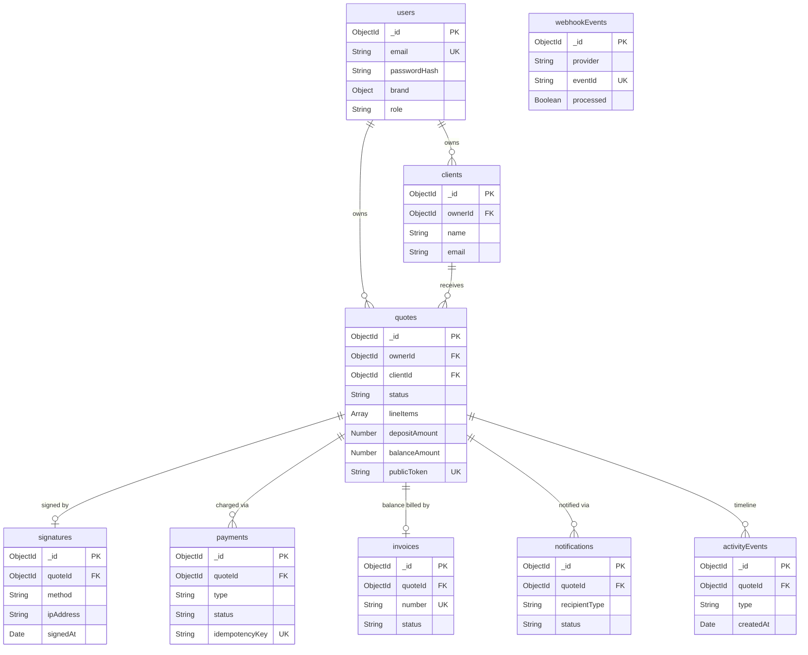

# PactLink — Database Design

## Overview

**Engine:** MongoDB (Atlas) via **Mongoose** ODM (per TRD). Document model chosen because a quote is a self-contained aggregate (line items embedded as subdocuments) read/written as a unit, while financial side-effects (signatures, payments, invoices, webhook events) are separate collections referenced by `quoteId` for append-only auditability.

**Design principles:**
- **Quote = aggregate root.** `lineItems[]` are embedded subdocuments (always loaded with the quote, never queried independently). All money-side records (`signatures`, `payments`, `invoices`, `notifications`, `activityEvents`) are separate collections referenced by `ObjectId` so they form an immutable audit trail.
- **Server-authoritative state.** Pipeline transitions (F-07) and `signature → charge → invoice` (F-09) are driven by Stripe/DocuSeal **webhooks**, never client callbacks. `webhookEvents.eventId` is UNIQUE to guarantee idempotent processing (F-11).
- **Money stored as integer minor units** (cents) in `Number` fields to avoid float drift. `currency` is ISO-4217 per quote.
- **Two trust boundaries.** Owner-scoped data (everything filtered by `ownerId`) and public client access (a single quote resolved only by `publicToken`, unauthenticated).

**Auth strategy:** JWT for owners (seeded accounts, no public signup — F-12). App-level Mongoose middleware/guards enforce access control (NOT RLS — MongoDB has no row-level policies). Every owner query is scoped by `ownerId` from the JWT; every public route is scoped by `publicToken` only and exposes a whitelisted projection.

---

## Collections

### Collection: `users`

**Purpose:** Business owners who build and send quotes. Login-only, seeded — no public signup (F-12).

**Relationships:** Referenced by `quotes.ownerId` (1 user → many quotes).

| Field | Type | Constraints | Description |
|-------|------|------------|-------------|
| `_id` | `ObjectId` | PK, auto | Primary key |
| `email` | `String` | required, UNIQUE, lowercase, trim | Login identifier |
| `passwordHash` | `String` | required | bcrypt hash; never returned in API responses (`select:false`) |
| `name` | `String` | required | Owner display name |
| `role` | `String` | enum [`owner`,`demo`], default `owner` | `demo` = sandbox/seeded account (F-12) |
| `brand` | `Object` | subdocument | Branding for PDFs (F-02) |
| `brand.businessName` | `String` | required | Shown on branded PDF + approval page |
| `brand.logoUrl` | `String` | nullable | Logo asset URL for PDF header |
| `brand.primaryColor` | `String` | default `#1B4965`, hex | Accent color on PDF + hosted link |
| `defaultCurrency` | `String` | enum (ISO-4217), default `USD` | Pre-fills new quotes |
| `defaultDepositType` | `String` | enum [`fixed`,`percent`], default `percent` | Pre-fills deposit config (F-05) |
| `defaultDepositValue` | `Number` | default `30` | Default % or fixed minor-unit amount |
| `stripeAccountId` | `String` | nullable | Connected Stripe account id (F-05) |
| `createdAt` | `Date` | auto (timestamps) | Creation time |
| `updatedAt` | `Date` | auto (timestamps) | Last update |

**Indexes:**
- `email` UNIQUE — login lookup, dedupe.

**Access Control:** App-level. A user document is readable/writable only by the matching authenticated JWT subject. `passwordHash` excluded via schema `select:false`. No public-route exposure.

---

### Collection: `clients`

**Purpose:** Quote recipients. No authentication — clients act only through unauthenticated `publicToken` links (F-03).

**Relationships:** Owned-by `users` (via `ownerId`); referenced by `quotes.clientId` (1 client → many quotes).

| Field | Type | Constraints | Description |
|-------|------|------------|-------------|
| `_id` | `ObjectId` | PK, auto | Primary key |
| `ownerId` | `ObjectId` | ref `users`, required, indexed | Owning business (scopes client to one owner) |
| `name` | `String` | required | Client contact name |
| `email` | `String` | required, lowercase, trim | Recipient for notifications (F-08) |
| `company` | `String` | nullable | Client company name |
| `phone` | `String` | nullable | Optional contact |
| `createdAt` | `Date` | auto | Creation time |
| `updatedAt` | `Date` | auto | Last update |

**Indexes:**
- `ownerId` — owner-scoped client list.
- `{ ownerId: 1, email: 1 }` — dedupe / lookup client by email within an owner.

**Access Control:** App-level, owner-scoped. Never exposed on public routes (only the embedded recipient name on the approval page is surfaced via the quote projection).

---

### Collection: `quotes`

**Purpose:** Core entity (F-01). Holds line items, totals, deposit config, public link token, pipeline status, and stage timestamps. Aggregate root.

**Relationships:** `ownerId` → `users`; `clientId` → `clients`. Referenced by `signatures`, `payments`, `invoices`, `notifications`, `activityEvents` (all via `quoteId`).

| Field | Type | Constraints | Description |
|-------|------|------------|-------------|
| `_id` | `ObjectId` | PK, auto | Primary key |
| `ownerId` | `ObjectId` | ref `users`, required, indexed | Owning business (access scope) |
| `clientId` | `ObjectId` | ref `clients`, required | Recipient |
| `title` | `String` | required | Quote title (e.g. "Kitchen Remodel") |
| `status` | `String` | enum `QuoteStatus`, default `draft`, indexed | Pipeline stage (F-07) |
| `currency` | `String` | enum (ISO-4217), required | Quote currency |
| `lineItems` | `[Object]` | embedded subdocuments | Line items (F-01); see subdocument table |
| `subtotal` | `Number` | required, default `0`, min `0` | Sum of selected line totals (minor units) |
| `taxTotal` | `Number` | required, default `0`, min `0` | Sum of tax on selected lines (minor units) |
| `total` | `Number` | required, default `0`, min `0` | `subtotal + taxTotal` (minor units) |
| `depositType` | `String` | enum [`fixed`,`percent`], required | Deposit mode (F-05) |
| `depositValue` | `Number` | required, min `0` | Fixed minor-unit amount, or percent (0–100) |
| `depositAmount` | `Number` | required, default `0`, min `0` | Computed deposit due (minor units) |
| `balanceAmount` | `Number` | required, default `0`, min `0` | `total − depositAmount` → balance invoice (F-06) |
| `publicToken` | `String` | required, UNIQUE, indexed | Unguessable token for shareable link (F-03) |
| `expiresAt` | `Date` | nullable | Public link / quote expiry |
| `pdfUrl` | `String` | nullable | Generated branded PDF location (F-02) |
| `sentAt` | `Date` | nullable | Stage timestamp → time-to-approval (F-10) |
| `viewedAt` | `Date` | nullable | First client view of public link (F-07/F-10) |
| `approvedAt` | `Date` | nullable | Approval (signature accepted) timestamp (F-10) |
| `depositPaidAt` | `Date` | nullable | Deposit settled via Stripe webhook (F-09/F-10) |
| `createdAt` | `Date` | auto | Creation time |
| `updatedAt` | `Date` | auto | Last update |

**Embedded subdocument: `lineItems[]`** (F-01)

| Field | Type | Constraints | Description |
|-------|------|------------|-------------|
| `_id` | `ObjectId` | auto | Subdocument id (stable client-side toggle key) |
| `label` | `String` | required | Line name |
| `description` | `String` | nullable | Detail text |
| `qty` | `Number` | required, min `0`, default `1` | Quantity |
| `unitPrice` | `Number` | required, min `0` | Unit price (minor units) |
| `taxRate` | `Number` | required, min `0`, default `0` | Percent (e.g. `8.25`) |
| `type` | `String` | enum [`standard`,`optional`,`tiered`], default `standard` | Toggle behavior (F-01) |
| `selected` | `Boolean` | default `true` | Whether included in totals; client-toggleable for `optional`/`tiered` (F-03) |
| `tierGroup` | `String` | nullable | Groups mutually-exclusive `tiered` options (one selected per group) |

**Indexes:**
- `publicToken` UNIQUE — public link resolution (F-03), prevents collisions.
- `ownerId` — owner dashboard list/filter.
- `{ ownerId: 1, status: 1 }` — pipeline kanban + funnel queries (F-07/F-10).
- `{ ownerId: 1, createdAt: -1 }` — recent quotes feed.
- `expiresAt` (sparse) — expiry sweeps.

**Access Control:** App-level, dual-boundary. **Owner routes:** every read/write filtered by `ownerId` from JWT. **Public routes:** resolved ONLY by `publicToken`, unauthenticated, returning a whitelisted projection (no `ownerId`, no internal ids beyond what the approval page needs). Totals are **recomputed server-side** on approval — client-submitted totals are never trusted.

---

### Collection: `signatures`

**Purpose:** Captured e-signature with legal evidence — timestamp + IP (F-04). Immutable once written; drives the F-09 state machine entry point.

**Relationships:** `quoteId` → `quotes` (typically 1 quote → 1 signature).

| Field | Type | Constraints | Description |
|-------|------|------------|-------------|
| `_id` | `ObjectId` | PK, auto | Primary key |
| `quoteId` | `ObjectId` | ref `quotes`, required, indexed | Signed quote |
| `signerName` | `String` | required | Name as typed/confirmed by signer |
| `method` | `String` | enum [`typed`,`drawn`], required | Signature capture mode (F-04) |
| `signatureData` | `String` | required | Typed string or base64 drawn-image / provider doc ref |
| `provider` | `String` | enum [`internal`,`docuseal`,`documenso`], default `internal` | E-sign infra used (F-04) |
| `providerEnvelopeId` | `String` | nullable | DocuSeal/Documenso submission id (for webhook correlation) |
| `ipAddress` | `String` | required | Signer IP at signing (evidence, F-04) |
| `userAgent` | `String` | nullable | Signer browser UA (evidence) |
| `signedAt` | `Date` | required | Signing timestamp (evidence, F-04) |
| `createdAt` | `Date` | auto | Record creation |

**Indexes:**
- `quoteId` — fetch signature for a quote.
- `providerEnvelopeId` (sparse) — correlate inbound DocuSeal/Documenso webhooks (F-11).

**Access Control:** App-level. Written by the public approval flow (scoped by `publicToken` of the parent quote) or by provider webhook. Read only by owner of the parent quote. Never updatable after creation (append-only evidence).

---

### Collection: `payments`

**Purpose:** Stripe payment attempts/records for deposit and balance (F-05). Server-authoritative — status mutated only by Stripe webhooks (F-09).

**Relationships:** `quoteId` → `quotes` (1 quote → many payments: a deposit + optional balance).

| Field | Type | Constraints | Description |
|-------|------|------------|-------------|
| `_id` | `ObjectId` | PK, auto | Primary key |
| `quoteId` | `ObjectId` | ref `quotes`, required, indexed | Related quote |
| `type` | `String` | enum [`deposit`,`balance`], required | Which charge (F-05/F-06) |
| `stripePaymentIntentId` | `String` | nullable, indexed | Stripe PaymentIntent id |
| `stripeChargeId` | `String` | nullable | Stripe Charge id (set on success) |
| `amount` | `Number` | required, min `0` | Amount (minor units) |
| `currency` | `String` | enum (ISO-4217), required | Charge currency |
| `status` | `String` | enum [`pending`,`succeeded`,`failed`], default `pending`, indexed | Payment state |
| `idempotencyKey` | `String` | required, UNIQUE | Guards duplicate charge creation (F-05/F-11) |
| `failureReason` | `String` | nullable | Stripe decline/error message on failure |
| `createdAt` | `Date` | auto | Creation time |
| `updatedAt` | `Date` | auto | Last update |

**Indexes:**
- `idempotencyKey` UNIQUE — prevents double-charging on retried webhooks/requests (F-11).
- `stripePaymentIntentId` (sparse) — correlate inbound Stripe webhooks.
- `quoteId` — payments for a quote.
- `{ quoteId: 1, type: 1 }` — fetch the deposit vs balance record.

**Access Control:** App-level. Created by approval flow (deposit) and by the state machine (balance). Status transitions ONLY from verified Stripe webhook handlers. Read only by owner of the parent quote.

---

### Collection: `invoices`

**Purpose:** Auto-generated balance invoice after deposit is paid (F-06). Output of the F-09 state machine.

**Relationships:** `quoteId` → `quotes` (1 quote → 0..1 balance invoice).

| Field | Type | Constraints | Description |
|-------|------|------------|-------------|
| `_id` | `ObjectId` | PK, auto | Primary key |
| `quoteId` | `ObjectId` | ref `quotes`, required, indexed | Source quote |
| `type` | `String` | enum [`balance`], default `balance` | Invoice kind (v1: balance only) |
| `number` | `String` | required, UNIQUE | Human-readable invoice number (e.g. `INV-2026-0007`) |
| `amount` | `Number` | required, min `0` | Balance due (minor units) = `quote.balanceAmount` |
| `currency` | `String` | enum (ISO-4217), required | Invoice currency |
| `status` | `String` | enum [`draft`,`sent`,`paid`], default `draft`, indexed | Invoice lifecycle |
| `stripeInvoiceId` | `String` | nullable | Stripe Invoice id (if issued via Stripe) |
| `issuedAt` | `Date` | nullable | When invoice sent to client |
| `dueAt` | `Date` | nullable | Payment due date |
| `paidAt` | `Date` | nullable | Settled (via webhook) |
| `createdAt` | `Date` | auto | Creation time |
| `updatedAt` | `Date` | auto | Last update |

**Indexes:**
- `number` UNIQUE — invoice numbering integrity.
- `quoteId` — invoice for a quote.
- `stripeInvoiceId` (sparse) — webhook correlation.
- `status` — owner invoice filtering.

**Access Control:** App-level. Generated by the state machine on `deposit_paid`. Status driven by Stripe invoice webhooks. Read only by owner of the parent quote (client receives via emailed link, not authenticated API).

---

### Collection: `webhookEvents`

**Purpose:** Append-only log of every inbound webhook (Stripe, DocuSeal/Documenso). **Source of truth for idempotent processing** (F-11) and the F-09 state machine.

**Relationships:** Logical correlation to `quotes`/`payments`/`signatures` via payload ids (not a hard ref — stored raw for audit).

| Field | Type | Constraints | Description |
|-------|------|------------|-------------|
| `_id` | `ObjectId` | PK, auto | Primary key |
| `provider` | `String` | enum [`stripe`,`docuseal`,`documenso`], required | Event source |
| `eventId` | `String` | required, UNIQUE | Provider event id — UNIQUE = idempotency guard (F-11) |
| `type` | `String` | required, indexed | Provider event type (e.g. `payment_intent.succeeded`) |
| `payload` | `Object` | required | Raw verified event body (audit) |
| `processed` | `Boolean` | default `false`, indexed | Whether business logic ran |
| `processedAt` | `Date` | nullable | When processing completed |
| `error` | `String` | nullable | Last processing error (for retry/inspection) |
| `receivedAt` | `Date` | default `now` | Ingest timestamp |
| `createdAt` | `Date` | auto | Record creation |

**Indexes:**
- `eventId` UNIQUE — atomic dedupe: insert-on-receive; a duplicate insert fails fast → event already processed (F-11).
- `type` — webhook event-log table filtering (F-11 UI).
- `processed` — find unprocessed/failed events for retry.
- `{ provider: 1, type: 1, createdAt: -1 }` — event-log table ordering/filtering.

**Access Control:** App-level. Written ONLY by signature-verified webhook endpoints (Stripe signature check / provider HMAC). The owner-facing event-log view (F-11) reads a redacted projection scoped to the owner's quotes; raw `payload` is admin-only.

---

### Collection: `notifications`

**Purpose:** Outbound email notification records to owner and client (F-08). Driven by webhook/pipeline events.

**Relationships:** `quoteId` → `quotes` (1 quote → many notifications).

| Field | Type | Constraints | Description |
|-------|------|------------|-------------|
| `_id` | `ObjectId` | PK, auto | Primary key |
| `quoteId` | `ObjectId` | ref `quotes`, required, indexed | Related quote |
| `channel` | `String` | enum [`email`], default `email` | Delivery channel (v1: email) |
| `recipientType` | `String` | enum [`owner`,`client`], required | Who is notified |
| `template` | `String` | enum `NotificationTemplate`, required | Email template key |
| `to` | `String` | required | Destination address |
| `status` | `String` | enum [`queued`,`sent`,`failed`], default `queued`, indexed | Delivery state |
| `error` | `String` | nullable | Provider error on failure |
| `sentAt` | `Date` | nullable | Delivery timestamp |
| `createdAt` | `Date` | auto | Creation time |
| `updatedAt` | `Date` | auto | Last update |

**Indexes:**
- `quoteId` — notifications for a quote.
- `status` — find queued/failed for retry/dispatch.

**Access Control:** App-level. Created by pipeline/webhook handlers. Read only by owner of the parent quote.

---

### Collection: `activityEvents`

**Purpose:** Append-only timeline of every meaningful quote event. Drives the pipeline (F-07) and funnel/time-to-approval analytics (F-10).

**Relationships:** `quoteId` → `quotes` (1 quote → many events).

| Field | Type | Constraints | Description |
|-------|------|------------|-------------|
| `_id` | `ObjectId` | PK, auto | Primary key |
| `quoteId` | `ObjectId` | ref `quotes`, required, indexed | Related quote |
| `type` | `String` | enum `ActivityType`, required, indexed | Event kind |
| `actor` | `String` | enum [`owner`,`client`,`system`], required | Who/what triggered it |
| `meta` | `Object` | nullable | Event detail (e.g. ip, amount, fromStatus/toStatus) |
| `createdAt` | `Date` | default `now`, indexed | Event time (analytics axis) |

**Indexes:**
- `{ quoteId: 1, createdAt: 1 }` — chronological timeline per quote.
- `{ type: 1, createdAt: 1 }` — funnel counts + time-to-approval aggregation (F-10).
- `quoteId` — quote activity lookup.

**Access Control:** App-level, append-only (no updates/deletes). Written by all flows (owner actions, public approval, webhooks). Read only by owner of the parent quote; aggregated cross-quote analytics scoped by `ownerId` via a `quotes` join.

---

## Cache Layer

N/A — TRD specifies no Redis/cache layer for v1. Idempotency is enforced at the database level via the `webhookEvents.eventId` and `payments.idempotencyKey` UNIQUE indexes rather than a cache.

---

## Enums / Constants

| Name | Values | Used In |
|------|--------|---------|
| `QuoteStatus` (F-07) | `draft`, `sent`, `viewed`, `approved`, `deposit_paid` | `quotes.status` |
| `UserRole` | `owner`, `demo` | `users.role` |
| `DepositType` (F-05) | `fixed`, `percent` | `quotes.depositType`, `users.defaultDepositType` |
| `LineItemType` (F-01) | `standard`, `optional`, `tiered` | `quotes.lineItems[].type` |
| `SignatureMethod` (F-04) | `typed`, `drawn` | `signatures.method` |
| `SignatureProvider` | `internal`, `docuseal`, `documenso` | `signatures.provider` |
| `PaymentKind` | `deposit`, `balance` | `payments.type` |
| `PaymentStatus` (F-05) | `pending`, `succeeded`, `failed` | `payments.status` |
| `InvoiceKind` | `balance` | `invoices.type` |
| `InvoiceStatus` (F-06) | `draft`, `sent`, `paid` | `invoices.status` |
| `WebhookProvider` | `stripe`, `docuseal`, `documenso` | `webhookEvents.provider`, `signatures.provider` |
| `NotificationChannel` | `email` | `notifications.channel` |
| `RecipientType` | `owner`, `client` | `notifications.recipientType` |
| `NotificationStatus` (F-08) | `queued`, `sent`, `failed` | `notifications.status` |
| `NotificationTemplate` (F-08) | `quote_sent`, `quote_viewed`, `quote_approved`, `deposit_paid`, `balance_invoice`, `payment_failed` | `notifications.template` |
| `ActivityType` (F-07/F-10) | `created`, `sent`, `viewed`, `selection_changed`, `signed`, `approved`, `deposit_paid`, `payment_failed` | `activityEvents.type` |
| `ActorType` | `owner`, `client`, `system` | `activityEvents.actor` |

### State machine (F-09) — webhook-driven, server-authoritative

```
client approves on public link
  → write signatures doc (F-04)            [actor: client]
  → quotes.status: viewed → approved, set approvedAt
  → create payments{type:deposit,status:pending} with idempotencyKey
  → create Stripe PaymentIntent for depositAmount

Stripe webhook: payment_intent.succeeded   [provider: stripe]
  → upsert webhookEvents (eventId UNIQUE → dedupe, F-11)
  → payments{type:deposit}.status: pending → succeeded
  → quotes.status: approved → deposit_paid, set depositPaidAt
  → if balanceAmount > 0: create invoices{type:balance,status:draft} (F-06)
  → enqueue notifications: deposit_paid (owner+client), balance_invoice (client)

Stripe webhook: payment_intent.payment_failed
  → upsert webhookEvents → payments.status: failed (quote stays approved)
  → activityEvents{type:payment_failed}; notification: payment_failed (owner)
```

---

## Relationships



**Reference summary (app-level joins via Mongoose `ref`/`populate`):**
- `clients.ownerId → users._id`
- `quotes.ownerId → users._id`, `quotes.clientId → clients._id`
- `signatures.quoteId / payments.quoteId / invoices.quoteId / notifications.quoteId / activityEvents.quoteId → quotes._id`
- `webhookEvents` — no hard ref; correlated to `payments.stripePaymentIntentId`, `signatures.providerEnvelopeId`, `invoices.stripeInvoiceId` via payload ids.

---

## Seed / Default Data (Sandbox + Case Study)

Seeds power the login-only demo (F-12) and the funnel/time-to-approval case study (F-10).

**Seeded `users`:**
- `demo@pactlink.app` — role `demo`, `brand.businessName: "Northwind Studio"`, `brand.primaryColor: #1B4965`, `defaultDepositType: percent`, `defaultDepositValue: 30`. Known password for sandbox login.

**Seeded `clients`:** ~6 clients under the demo owner (mixed `company` set/null).

**Seeded `quotes`:** ~12 quotes spread across all `QuoteStatus` values to make the funnel non-trivial, e.g.:
- 3 `sent` (with `sentAt`), 3 `viewed` (with `sentAt`,`viewedAt`), 2 `approved` (+ `approvedAt`, a `signatures` doc each), 3 `deposit_paid` (+ `depositPaidAt`, `payments{deposit,succeeded}`, `invoices{balance}`), 1 `draft`.
- Stage timestamps spaced over days so **time-to-approval** (`approvedAt − sentAt`) and **funnel** (viewed → approved → deposit_paid) render meaningfully (F-10).
- Each includes `optional` and `tiered` line items so the client toggle demo (F-01/F-03) works.

**Seeded supporting records:**
- `signatures` for approved/paid quotes (mixed `typed`/`drawn`, with `ipAddress`/`signedAt`).
- `payments` for paid quotes (`succeeded` deposits + one sample `failed` to exercise the failure path).
- `invoices` (`balance`) for paid quotes with sequential `number`s.
- `webhookEvents` mirroring the seeded payments/signatures (`processed:true`) so the event-log table (F-11) has realistic rows.
- `notifications` (`sent`) across both `recipientType`s; `activityEvents` covering the full timeline of each quote to drive the pipeline + funnel.

**Default values (on create):** `quotes.status=draft`, `currency` from `users.defaultCurrency`, `depositType/Value` from owner defaults, `lineItems[].selected=true`, `payments.status=pending`, `invoices.status=draft`, `notifications.status=queued`, `webhookEvents.processed=false`.
